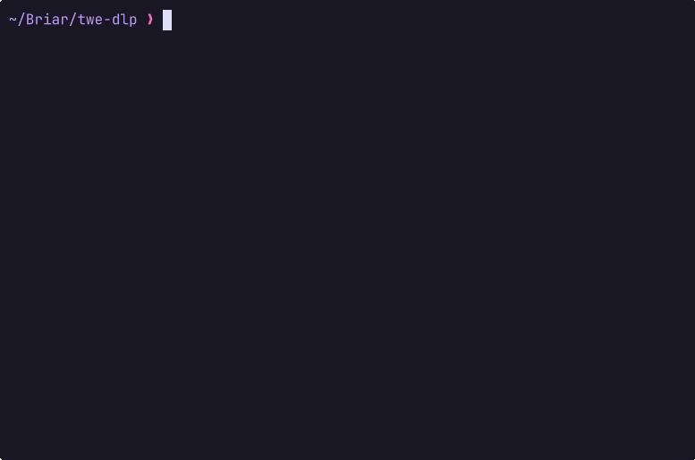

 

`A CLI tool that downloads every Twitch emote from a channel.`

### Disclaimer
Emote and badge images are property of Twitch Interactive or their respective owners. 
Do not reuse without obtaining their permission.

### Usage
Run with no arguments (interactive prompt):

 

Non Interactive:

```bash
./twe-dlp <username>|<userid>
```


### Installation

```bash
go install github.com/odesaur/twe-dlp@latest
```

### Build locally

```bash
git clone https://github.com/odesaur/twe-dlp
cd twe-dlp
go install .
```
